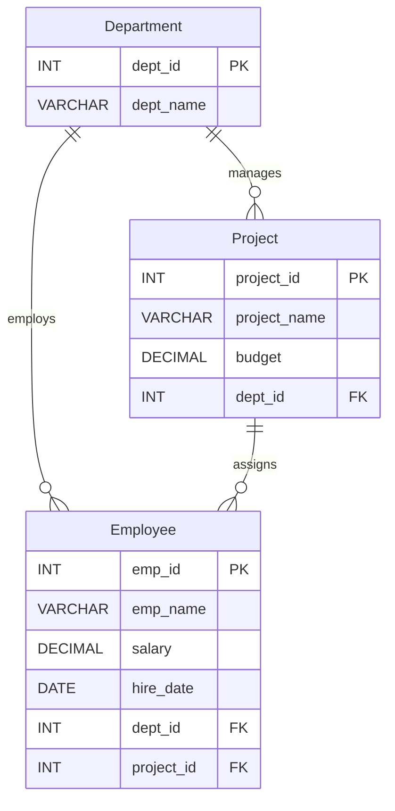

# Experiment 03: Employee-Department-Project Database

**DBMS Lab | MySQL | SQL Queries and Data Analysis**

## Aim

To create an **Employee-Department-Project** relational database, insert at least **30 employees** across **5 departments** and **8 projects**, and demonstrate SQL queries using **Selection, Projection, Aggregate Functions, GROUP BY, HAVING, CASE expressions, and ORDER BY**.

## Overview

This experiment uses a sample company database named `CompanyDB`. It contains three related tables, populated with the same sample records from the lab experiment. A three-table `JOIN` query is also included to display employee, department, and project information together.

### Database structure

| Table | Records | Description |
|---|---:|---|
| `Department` | 5 | Company departments: IT, HR, Finance, Marketing, Operations |
| `Project` | 8 | Projects and their budgets, each linked to a department |
| `Employee` | 30 | Employee details, salaries, joining dates, departments, and projects |

## Files

| File | Purpose |
|---|---|
| [`01_company_schema_and_data.sql`](./01_company_schema_and_data.sql) | Creates `CompanyDB`, defines the three related tables, inserts all sample records, and verifies record counts |
| [`02_sql_queries.sql`](./02_sql_queries.sql) | Contains all eight queries from the lab experiment, with short descriptions |

## Concepts demonstrated

| # | SQL concept | What it does |
|---|---|---|
| 1 | **Selection (`WHERE`)** | Finds employees earning more than 70,000 |
| 2 | **Projection (`SELECT` columns)** | Returns only employee names and salaries |
| 3 | **Aggregate functions** | Uses `COUNT`, `AVG`, `MAX`, `MIN`, and `SUM` on salaries |
| 4 | **GROUP BY** | Calculates the number of employees and average salary per department |
| 5 | **HAVING** | Filters departments with average salary above 65,000 |
| 6 | **CASE expression** | Labels salaries as High, Medium, or Low |
| 7 | **ORDER BY** | Sorts employees by salary (highest first) |
| 8 | **JOIN** | Combines Employee, Department, and Project information |

## How to run (MySQL Workbench)

1. Open **MySQL Workbench** and connect to your MySQL server.
2. Open [`01_company_schema_and_data.sql`](./01_company_schema_and_data.sql) and execute the complete script using the **lightning bolt** button. This creates the database, tables, and sample data.
3. Confirm the record counts: **5 departments, 8 projects, and 30 employees**.
4. Open [`02_sql_queries.sql`](./02_sql_queries.sql) and run the complete file, or select individual queries to execute them one by one.
5. Review the result grids for each SQL operation.

> **Note:** Re-running the first script **drops and recreates** the `Employee`, `Project`, and `Department` tables inside `CompanyDB`. Do not run it against tables with data you need to keep.

## Sample results

The following values are derived from the sample records included with this experiment.

### Aggregate functions

| Metric | Result |
|---|---:|
| Total employees | 30 |
| Average salary | 63,466.67 |
| Highest salary | 83,000.00 |
| Lowest salary | 47,000.00 |
| Total salary | 1,904,000.00 |

### GROUP BY: department summary

| Department | Employees | Average salary |
|---|---:|---:|
| IT | 6 | 67,833.33 |
| HR | 6 | 53,666.67 |
| Finance | 6 | 69,166.67 |
| Marketing | 6 | 60,166.67 |
| Operations | 6 | 66,500.00 |

### HAVING: average salary > 65,000

| Department | Average salary |
|---|---:|
| IT | 67,833.33 |
| Finance | 69,166.67 |
| Operations | 66,500.00 |

### CASE: salary categories

| Category | Condition |
|---|---|
| High Salary | `salary >= 75000` |
| Medium Salary | `salary >= 60000` and `< 75000` |
| Low Salary | `salary < 60000` |

## Result

Created an Employee-Department-Project database containing **30 employees, 5 departments, and 8 projects** and demonstrated **eight SQL operations**: Selection, Projection, Aggregate Functions, GROUP BY, HAVING, CASE, ORDER BY, and JOIN.

---

*DBMS Laboratory — Experiment 03*
