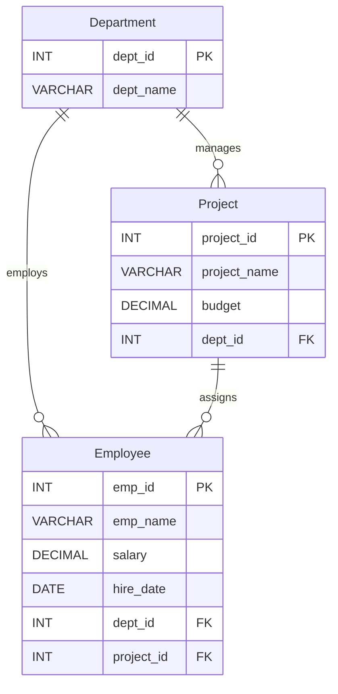

# Experiment 04: SQL JOINs, Subqueries & EXPLAIN

**DBMS Lab | MySQL | Employee–Department–Project Database**

## Aim

Using the **Employee** schema, write and execute SQL queries with **INNER JOIN, LEFT JOIN, self-join, three-way JOIN, correlated subqueries, EXISTS, and simulated INTERSECT and EXCEPT**. Compare the execution plans of selected queries using **EXPLAIN**.

## Overview

This experiment continues **Experiment 03**. It uses the same `CompanyDB` database with **30 employees, 5 departments, and 8 projects**. The focus here is on combining related records, filtering with subqueries, simulating set operations, and inspecting MySQL's query plans.

> **Prerequisite:** First create the sample database using [`Experiment-03/01_company_schema_and_data.sql`](../Experiment-03/01_company_schema_and_data.sql). **Experiment 04 does not create or insert data**; both SQL files depend on Experiment 03's tables.

### Schema used

| Table | Sample records | Main use |
|---|---:|---|
| `Department` | 5 | Department names and IDs |
| `Project` | 8 | Project names, budgets, and department IDs |
| `Employee` | 30 | Employee details, salaries, and foreign keys |

## Project files

| File | Description |
|---|---|
| [`01_joins_and_subqueries.sql`](./01_joins_and_subqueries.sql) | Eight SQL queries: JOINs, correlated subquery, EXISTS, simulated INTERSECT and EXCEPT |
| [`02_explain_execution_plans.sql`](./02_explain_execution_plans.sql) | Three `EXPLAIN` statements for INNER JOIN, correlated subquery, and EXISTS |
| [`README.md`](./README.md) | Aim, database dependency, explanations, steps, and sample results |

## SQL queries covered

| # | Topic | What the query demonstrates |
|---|---|---|
| 1 | **INNER JOIN** | Combines matching employees with their departments |
| 2 | **LEFT JOIN** | Keeps all departments, including those without matching employees |
| 3 | **Self-join** | Compares pairs of employees within the same department |
| 4 | **Three-way JOIN** | Combines employee, department, and project information |
| 5 | **Correlated subquery** | Finds employees paid above their own department's average |
| 6 | **EXISTS** | Finds departments with at least one employee earning more than 80,000 |
| 7 | **Simulated INTERSECT** | Finds IT employees earning more than 70,000 |
| 8 | **Simulated EXCEPT** | Finds employees earning more than 70,000 who are not in IT |

The simulated set operations use `IN` and `NOT IN`, following the lab PDF. They do not require native `INTERSECT` or `EXCEPT` syntax.

## How to run in MySQL Workbench

1. Open **MySQL Workbench** and connect to your MySQL server.
2. If you have **not** completed Experiment 03, run its [`01_company_schema_and_data.sql`](../Experiment-03/01_company_schema_and_data.sql) file first to create `CompanyDB` and insert the sample records.
3. Open [`01_joins_and_subqueries.sql`](./01_joins_and_subqueries.sql). Run the file with the **lightning bolt** button, or highlight one `SELECT` at a time to view each result grid separately.
4. Open [`02_explain_execution_plans.sql`](./02_explain_execution_plans.sql) and run the `EXPLAIN` statements one by one.
5. Compare the execution plan columns such as `type`, `possible_keys`, `key`, `rows`, and `Extra`.

> **Important:** Experiment 03's setup file drops and recreates its three tables when re-run, so running it again will erase any changes made to those tables. The two Experiment 04 scripts are read-only: they contain only `SELECT` and `EXPLAIN` statements.

## Selected results

With the **original Experiment 03 sample data**, the queries give these results:

| Query | Expected result |
|---|---|
| INNER JOIN | 30 employees matched to departments |
| LEFT JOIN | 30 rows; all 5 departments contain employees in this sample |
| Self-join | First 10 distinct employee pairs (`LIMIT 10`) |
| Three-way JOIN | 30 employee–department–project rows |
| Correlated subquery | Employees whose salary exceeds their own department's average |
| EXISTS | **IT** and **Finance** |
| Simulated INTERSECT | **Vivaan** and **Arjun** |
| Simulated EXCEPT | **Rohan, Nikhil, Manav, Dhruv, Rudra** |

### Example: Simulated INTERSECT

Employees who work in **IT** and earn **more than 70,000**:

| emp_id | emp_name | salary |
|---:|---|---:|
| 2 | Vivaan | 72,000.00 |
| 4 | Arjun | 81,000.00 |

### Example: EXISTS

Departments containing an employee with a salary over **80,000**:

| dept_id | dept_name |
|---:|---|
| 1 | IT |
| 3 | Finance |

## EXPLAIN: comparing execution plans

`EXPLAIN` estimates how MySQL will execute a statement. This experiment compares the **INNER JOIN**, **correlated subquery**, and **EXISTS** queries.

| Query pattern | Focus when reading `EXPLAIN` |
|---|---|
| INNER JOIN | Table access and join condition on `dept_id` |
| Correlated subquery | How the optimizer handles the inner departmental average |
| EXISTS | How the optimizer searches for matching qualifying rows |

The PDF discusses *possible* plan behaviors rather than giving measured `EXPLAIN` result tables. **Do not assume that one specific access method or row count will appear on every MySQL installation.** MySQL versions, indexes, table statistics, and data size can change the plan. With this small dataset, even a table scan may be reasonable.

## Result

Used the Employee–Department–Project database to demonstrate **eight JOIN/subquery/set-operation queries** and prepare **three `EXPLAIN` statements** for understanding query execution strategies.

---

*DBMS Laboratory — Experiment 04*
