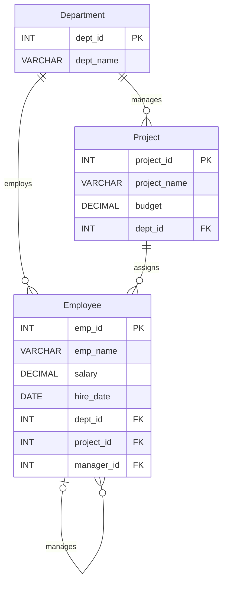

# Experiment 05: SQL Views, View Updatability & Recursive CTE

**DBMS Lab | MySQL 8.0+ | Employee–Department–Project Database**

## Aim

To create **SQL views for department salary summary and employee hierarchy**, test the **updatability of views**, and implement a **recursive Common Table Expression (CTE)** to display reporting chains.

## Overview

This experiment builds on [Experiment 03](../Experiment-03/README.md) and uses the same **`CompanyDB`** dataset with **30 employees**, **5 departments**, and **8 projects**. It extends the `Employee` table with `manager_id`, creates two reporting views, examines which types of views support updates, and uses recursion to trace reporting paths.

> **Prerequisite:** Set up the database using [Experiment 03's schema and sample data](../Experiment-03/01_company_schema_and_data.sql) **before** running these files. Do not rerun Experiment 03's reset script after adding the hierarchy, since it drops and recreates the base tables.

### Database relationships



## Project files

| File | Purpose |
|---|---|
| [`01_manager_hierarchy_setup.sql`](./01_manager_hierarchy_setup.sql) | Adds `manager_id`, self-referencing foreign key, and example manager assignments |
| [`02_views_and_reporting_chain.sql`](./02_views_and_reporting_chain.sql) | Creates salary and hierarchy views, then displays recursive reporting chains |
| [`03_view_updatability_tests.sql`](./03_view_updatability_tests.sql) | Demonstrates a successful update through a simple view, a rollback, and optional non-updatable-view tests |
| `README.md` | Experiment aim, setup instructions, SQL concepts, and expected results |

## SQL concepts covered

### 1. Department salary summary view

`department_salary_summary` uses `INNER JOIN`, `GROUP BY`, and aggregate functions to return **one row per department**:

- `COUNT()` — employee count
- `AVG()` — average salary
- `MIN()` / `MAX()` — minimum and maximum salary
- `SUM()` — total salary

With the original Experiment 03 sample data, the result is:

| Department | Employees | Average salary | Minimum | Maximum | Total salary |
|---|---:|---:|---:|---:|---:|
| IT | 6 | 67,833.33 | 58,000 | 81,000 | 407,000 |
| HR | 6 | 53,666.67 | 47,000 | 61,000 | 322,000 |
| Finance | 6 | 69,166.67 | 56,000 | 83,000 | 415,000 |
| Marketing | 6 | 60,166.67 | 51,000 | 70,000 | 361,000 |
| Operations | 6 | 66,500.00 | 59,000 | 76,000 | 399,000 |

*Values shown to two decimal places for readability; SQL `AVG()` may display more digits.*

### 2. Employee hierarchy view

`employee_hierarchy` combines `Employee`, `Department`, and a **second reference to `Employee`** (the manager) using a self-join. Each row contains the employee's immediate manager's name, where available. Department heads have `manager_id = NULL`.

For example:

| Employee | Department | Reports to |
|---|---|---|
| Aarav | IT | `NULL` — department head |
| Aditya | IT | Aarav |
| Reyansh | IT | Aditya |
| Aanya | Marketing | `NULL` — department head |
| Kiara | Marketing | Aanya |
| Riya | Marketing | Kiara |
| Navya | Marketing | Riya |

### 3. Testing view updatability

A *simple, single-table view* (`employee_salary_edit`) supports an `UPDATE` of an underlying `Employee` salary. The script wraps the change in a transaction and uses `ROLLBACK`, restoring the original data.

By contrast, `department_salary_summary` contains aggregate functions and `GROUP BY`, so its calculated `average_salary` cannot be updated directly.

**Important MySQL nuance:** The lab PDF suggests that `employee_hierarchy` must fail to update because it has joins. MySQL can sometimes update joined views when the update is unambiguous and affects a permissible underlying table. For accuracy, the original joined-view test is provided as a **commented, optional** statement. To observe your server's behavior, run that test manually in a transaction and roll it back.

### 4. Recursive CTE — reporting chains

The `WITH RECURSIVE` query starts with employees whose `manager_id IS NULL` (**anchor query**) and finds subordinates repeatedly (**recursive query**), building a readable reporting path.

Example paths:

```text
Aarav -> Aditya -> Reyansh
Aarav -> Vivaan -> Arjun
Aanya -> Kiara -> Riya -> Navya
```

The CTE assigns `level = 1` to department heads and increases the level by one for each reporting step.

## How to run in MySQL Workbench

1. Open **MySQL Workbench** and connect to a **MySQL 8.0+** server.
2. **Only if `CompanyDB` has not been created:** execute [`Experiment-03/01_company_schema_and_data.sql`](../Experiment-03/01_company_schema_and_data.sql). This script **resets** the three experiment tables, so avoid running it when you have important changes to preserve.
3. Execute [`01_manager_hierarchy_setup.sql`](./01_manager_hierarchy_setup.sql) **once** to add `manager_id`, its foreign key, and the manager assignments.
4. Execute [`02_views_and_reporting_chain.sql`](./02_views_and_reporting_chain.sql). View each `SELECT` result in Workbench's result grids.
5. Execute [`03_view_updatability_tests.sql`](./03_view_updatability_tests.sql). It will update a salary temporarily and then **ROLLBACK** the change.
6. To examine the expected aggregate-view update error, **highlight and run only the commented statement after removing its `--` markers**. That failing statement is deliberately not executed with the main script.

**Execution order:** `Experiment 03 setup` → `01_manager_hierarchy_setup.sql` → `02_views_and_reporting_chain.sql` → `03_view_updatability_tests.sql`.

> **Run-once note:** Re-running `01_manager_hierarchy_setup.sql` without resetting your schema gives a *duplicate column* error, because the `manager_id` column already exists. The two later scripts can be run again without resetting the base data.

## Notes on the supplied lab PDF

The supplied experiment specifies a `manager_id` relationship and shows example reporting chains, but does **not** include SQL for adding or populating `manager_id`. The first SQL file therefore adds **illustrative manager assignments**, matching the reporting chains visible in the PDF where possible and completing the missing assignments for the remaining employees.

The original PDF also describes both view-update attempts as failures. The grouped summary is non-updatable; the joined hierarchy view requires an actual MySQL test to determine updatability for the particular statement, so no universal failure is claimed here.

## Result

The `CompanyDB` employee records were used to define **department-wise salary summaries**, display **employee–manager relationships**, compare **updatable and non-updatable views**, and build multi-level **reporting chains using a recursive CTE**.

---

**DBMS Laboratory · Experiment 05**
