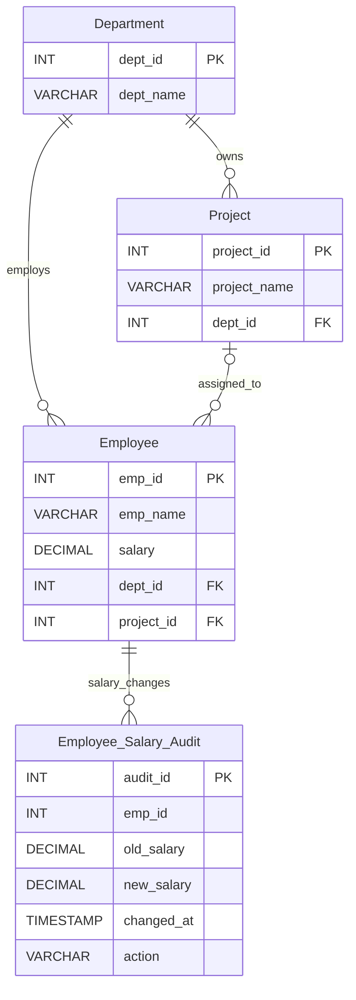

# Experiment 06: Stored Procedures, Salary Triggers & Audit Logging

**DBMS Lab | MySQL 8.0+ | Employee–Department–Project Database**

## Aim

To create a **`transfer_employee(emp_id, new_dept_id)` stored procedure** with validation and error handling, implement **salary-validation and audit triggers**, and test important edge cases.

## Overview

This experiment uses the **`CompanyDB`** database created in [Experiment 03](../Experiment-03/README.md), containing **30 employees, 5 departments, and 8 projects**. It demonstrates controlled employee transfers, automatic salary checks, and an audit trail of salary changes.

> **Prerequisite:** Create and populate `CompanyDB` using [Experiment 03's schema/data script](../Experiment-03/01_company_schema_and_data.sql). **Do not rerun that script after Experiment 05** if you need to preserve `manager_id` and other changes—it drops and recreates the base tables. Experiment 05 is *not required* to run Experiment 06.

## Files

| File | Purpose |
|---|---|
| [`01_salary_audit_and_triggers.sql`](./01_salary_audit_and_triggers.sql) | Creates the salary-audit table, `BEFORE INSERT`, `BEFORE UPDATE`, and `AFTER UPDATE` triggers |
| [`02_transfer_employee_procedure.sql`](./02_transfer_employee_procedure.sql) | Creates the `transfer_employee` procedure with validation, transaction, and error handling |
| [`03_test_cases.sql`](./03_test_cases.sql) | Demonstrates a valid transfer, valid salary update, audit entries, and optional invalid-input tests |
| `README.md` | Documentation and execution instructions |

## Database relationships



*The audit table stores `emp_id` for reference without declaring a foreign key; audit history can therefore remain available independently of the Employee row. The diagram illustrates the logical relationship.*

## SQL concepts covered

### 1. Salary audit table

`Employee_Salary_Audit` records the employee ID, salary before and after the change, time, and action type. It is populated automatically by a trigger—not by the application writing audit entries manually.

### 2. Salary-validation triggers

Two separate triggers reject salary values **outside 30,000–150,000**, including `NULL` values:

- `validate_employee_salary`: `BEFORE INSERT ON Employee`
- `validate_employee_salary_update`: `BEFORE UPDATE ON Employee`

Both raise a descriptive MySQL error using `SIGNAL SQLSTATE '45000'`.

> **Important correction:** The original lab PDF defines a `BEFORE INSERT` trigger but then demonstrates an invalid salary `UPDATE`. An INSERT trigger does *not* fire on UPDATE; the second trigger is added here to make the demonstrated update validation work.

### 3. Salary audit trigger

`audit_salary_update` runs `AFTER UPDATE` and inserts a record **only when the actual salary changes**. It uses MySQL's NULL-safe equality operator (`<=>`) so unrelated updates do not generate salary-audit entries.

### 4. Stored procedure: `transfer_employee`

The stored procedure takes an employee ID and a target department ID, then:

1. Begins a transaction.
2. Checks that the employee exists.
3. Checks that the destination department exists.
4. Locks and checks the employee's current department, rejecting a repeated transfer to the same department.
5. Updates `Employee.dept_id` and commits.
6. Uses an `EXIT HANDLER FOR SQLEXCEPTION` to **roll back** failed transfers and `RESIGNAL` the error.

Example call:

```sql
CALL transfer_employee(6, 4);
```

With the original Experiment 03 data, employee **Reyansh** (`emp_id = 6`) moves from **IT (`dept_id = 1`)** to **Marketing (`dept_id = 4`)**.

> **Schema design note:** Following the lab PDF, this procedure changes **only `dept_id`**. `project_id` and (if Experiment 05 was completed) `manager_id` retain their previous values; in a real HR system, a transfer should also review project and manager assignments. This basic exercise does not enforce same-department project/manager alignment.

## Test cases and expected behavior

| Test | Example | Expected behavior |
|---|---|---|
| Valid transfer | `CALL transfer_employee(6, 4);` | Employee 6 moves to Marketing |
| Invalid employee | `CALL transfer_employee(99, 4);` | `Employee does not exist` |
| Invalid department | `CALL transfer_employee(6, 99);` | `Department does not exist` |
| Same department | Call `(6, 4)` after the successful transfer | `Employee is already in this department` |
| Invalid salary update | Set employee 6 salary to `20000` | Rejected with SQLSTATE `45000` |
| Invalid salary insert | Insert employee 31 with salary `20000` | Rejected with SQLSTATE `45000` |
| Valid salary update | Set employee 6 salary to `85000` | Succeeds and writes an audit record |
| Unrelated employee update | Change only `dept_id` | No salary-audit entry |

Example audit entry when starting with the untouched Experiment 03 sample data (timestamp and audit ID depend on execution):

| emp_id | old_salary | new_salary | action |
|---:|---:|---:|---|
| 6 | 62000.00 | 85000.00 | SALARY UPDATE |

**Failing test statements are commented out** in the script so that the successful demonstrations can be executed without stopping at an intentional error. Uncomment and execute failing statements **one at a time** to observe the respective error messages.

## How to run in MySQL Workbench

1. Open **MySQL Workbench** and connect to a **MySQL 8.0+** server.
2. If `CompanyDB` does not yet exist, run [Experiment 03's setup script](../Experiment-03/01_company_schema_and_data.sql) once. **Warning:** that script resets the tables.
3. Open and run [`01_salary_audit_and_triggers.sql`](./01_salary_audit_and_triggers.sql). This creates the audit table and three triggers.
4. Open and run [`02_transfer_employee_procedure.sql`](./02_transfer_employee_procedure.sql). This creates the stored procedure.
5. Open and run [`03_test_cases.sql`](./03_test_cases.sql). Check the transfer result, updated salary, and audit log displayed by the SELECT statements.
6. To test errors, uncomment one negative test at a time in `03_test_cases.sql`, select only that statement, and execute it. **Those errors are intentional.**

**Execution order:** `Experiment 03 setup (if needed)` → `01_salary_audit_and_triggers.sql` → `02_transfer_employee_procedure.sql` → `03_test_cases.sql`.

**Important:** The third file changes employee 6's department and salary in the database. Run it **once on the original sample data** for the stated expected outputs; repeating it will fail at the transfer step because that employee is already in department 4. Scripts 01 and 02 may be rerun without resetting Employee rows (script 01 retains audit history).

## Notes on the supplied lab PDF

The PDF uses employee ID `31` in one audit-update example, whereas the original CompanyDB data contains only employees **1–30**, and its displayed audit output refers to employee **6**. This GitHub version uses **employee 6** consistently for the successful salary update and reserves ID 31 for the optional invalid-insert demonstration. The PDF also mentions a transfer from "Development" to "Sales"; the actual Experiment 03 data uses department **IT (1)** and **Marketing (4)**, so this README uses the dataset's real labels.

The PDF shows a salary-validation error during UPDATE but only defines an INSERT trigger. The extra update-validation trigger fixes that inconsistency. These are improvements to the original exercise, not claims that all code was present in the handwritten/submitted material.

## Result

A transaction-safe **employee-transfer procedure** with ID validation and error handling was prepared, salary limits are enforced using INSERT/UPDATE triggers, and successful salary changes are recorded automatically in an **audit table**. Positive and negative test cases demonstrate the intended behavior.

---

**DBMS Laboratory · Experiment 06**
